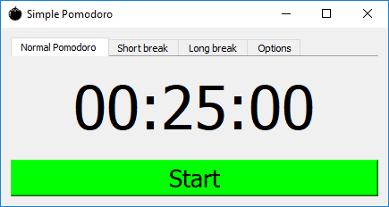
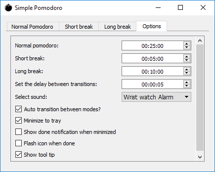

# Pomodoro

Simple pomodoro timer.

## About

This is a simple [pomodoro](https://en.wikipedia.org/wiki/Pomodoro_Technique) technique timer written using PySide (Qt4) in Python.

  
  

### Usage

Requirements: PySide (<= 1.2.4).  
``` py pomodoro.py ```  
